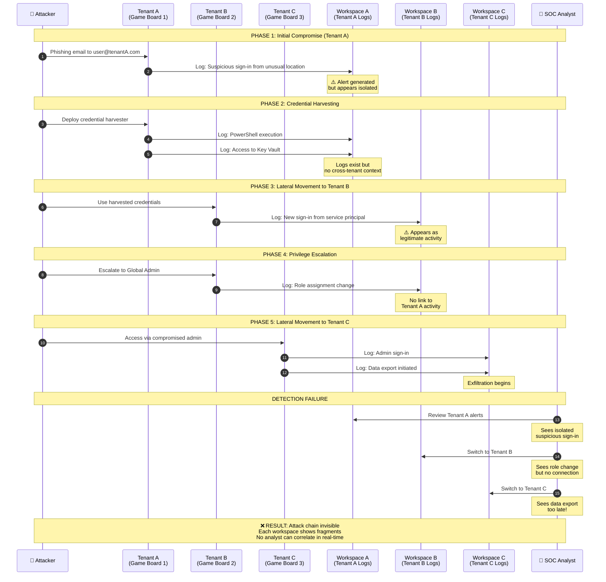
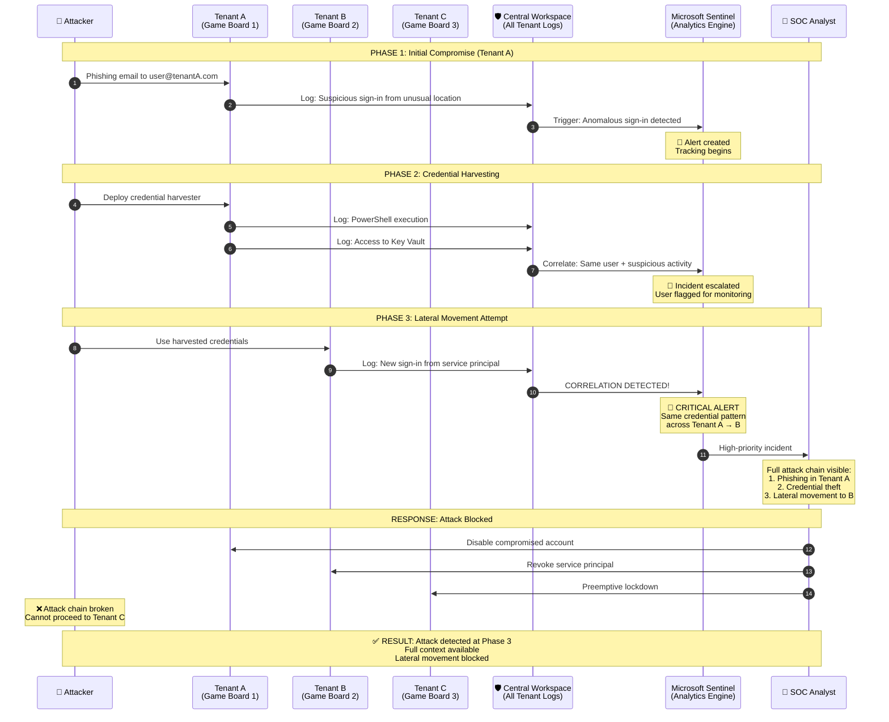
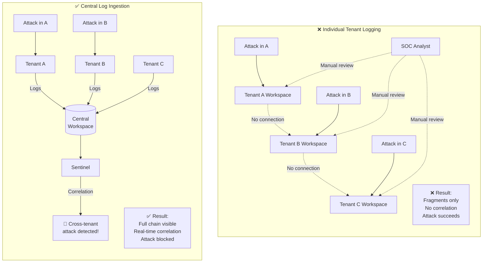
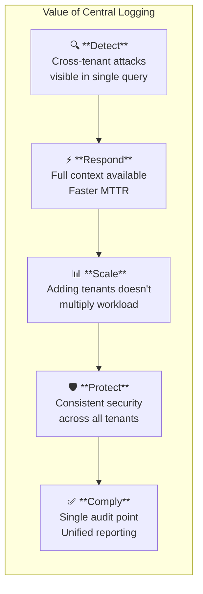

# Central Log Ingestion vs Individual Tenant Logging

> **Architecture Decision Guide** | Multi-Tenant Logging Strategy for Simulation Environments

---

## Table of Contents

- [Executive Summary](#executive-summary)
- [The Challenge: Multi-Tenant Visibility](#the-challenge-multi-tenant-visibility)
- [Architecture Comparison](#architecture-comparison)
- [Central Log Ingestion](#central-log-ingestion)
- [Individual Tenant Logging](#individual-tenant-logging)
- [Attack Scenario: Why Central Logging Matters](#attack-scenario-why-central-logging-matters)
  - [Scenario 1: Individual Tenant Logging](#scenario-1-individual-tenant-logging-attack-goes-undetected)
  - [Scenario 2: Central Log Ingestion](#scenario-2-central-log-ingestion-attack-detected-and-stopped)
  - [The Detection Difference](#the-detection-difference)
  - [Key Correlation Queries](#key-correlation-queries-only-possible-with-central-logging)
- [Decision Framework](#decision-framework)
- [Recommendation](#-recommendation-central-log-ingestion)
- [Implementation Path](#implementation-path)

---

## Executive Summary

When managing multiple Azure tenants such as simulation game boards, organisations face a critical architectural decision: **centralise logs into a single workspace** or **keep logs distributed across individual tenants**.

This document provides a comprehensive comparison to support that decision, including a detailed attack scenario demonstrating why central logging is essential for threat detection.

**For simulation environments requiring cross-tenant visibility and threat detection, central log ingestion is the recommended approach.**

---

## The Challenge: Multi-Tenant Visibility

With individual tenant logging, each simulation game board maintains its own Log Analytics workspace. This creates a fundamental visibility problem:

| Scenario | Individual Logging | Central Logging |
|----------|-------------------|-----------------|
| **Analyst workflow** | Must switch between N workspaces | Single workspace for all tenants |
| **Cross-tenant attacks** | Invisible - fragments in separate workspaces | Visible - full attack chain in one place |
| **Correlation capability** | Manual, after-the-fact | Real-time, automated |
| **Time to detect** | Hours to days (if ever) | Minutes |

**The core problem**: An attacker moving laterally between tenants leaves traces in multiple workspaces that no single analyst can correlate in real-time. See the [Attack Scenario](#attack-scenario-why-central-logging-matters) section for a detailed demonstration.

---

## Architecture Comparison

| Architecture | Description |
|--------------|-------------|
| **Central Log Ingestion** | All logs from source tenants flow into a single Log Analytics workspace in a managing tenant |
| **Individual Tenant Logging** | Each tenant maintains its own Log Analytics workspace; logs remain in their source tenant |

### Side-by-Side Comparison

| Criteria | Central Log Ingestion | Individual Tenant Logging |
|----------|:---------------------:|:-------------------------:|
| **Unified Visibility** | ✅ Single pane of glass | ❌ Requires switching between tenants |
| **Cross-Tenant Correlation** | ✅ Native queries across all data | ❌ Requires complex cross-workspace queries |
| **Setup Complexity** | ⚠️ Higher (Lighthouse, Event Hub, APIs) | ✅ Lower (standard diagnostic settings) |
| **Ongoing Maintenance** | ✅ Centralised management | ❌ Per-tenant management overhead |
| **Data Sovereignty** | ⚠️ Data leaves source tenant | ✅ Data stays in source tenant |
| **Cost Model** | ✅ Single workspace billing | ❌ Multiple workspace costs |
| **Security Operations** | ✅ Centralised SOC | ❌ Distributed monitoring |
| **Scalability** | ✅ Scales with single workspace | ⚠️ Linear workspace growth |
| **Incident Response** | ✅ Full context in one location | ❌ Context scattered across workspaces |

---

## Central Log Ingestion

### Benefits

| Benefit | Description |
|---------|-------------|
| **Unified Security Monitoring** | Single Microsoft Sentinel instance for threat detection across all tenants |
| **Cross-Tenant Correlation** | Detect attack patterns spanning multiple tenants with simple queries |
| **Operational Efficiency** | One team manages one workspace instead of N workspaces |
| **Consistent Alerting** | Single set of analytics rules applies to all tenant data |
| **Simplified Reporting** | Unified dashboards and workbooks across all environments |
| **Cost Optimisation** | Potential volume discounts; avoid per-workspace overhead |
| **Faster Incident Response** | All context available in one location; reduced MTTR |

### Considerations

| Consideration | Mitigation |
|---------------|------------|
| **Setup Complexity** | One-time investment; use automation scripts |
| **Data Sovereignty** | Implement proper tagging and RBAC segregation |
| **Single Point of Failure** | Use Azure's built-in workspace resilience |
| **Permission Management** | Design RBAC model upfront; use PIM for elevation |

---

## Individual Tenant Logging

### Benefits

| Benefit | Description |
|---------|-------------|
| **Data Sovereignty** | Logs remain in source tenant; meets strict compliance requirements |
| **Natural Isolation** | No risk of cross-tenant data leakage |
| **Simple Setup** | Standard Azure diagnostic settings; no cross-tenant configuration |
| **Tenant Autonomy** | Each tenant controls their own logging configuration |

### Limitations

| Limitation | Impact |
|------------|--------|
| **Fragmented Visibility** | Must switch between tenants to view logs |
| **No Native Correlation** | Cross-tenant attack detection is extremely difficult |
| **Operational Overhead** | N workspaces = N times the management effort |
| **Multiple Sentinel Instances** | Each tenant needs its own Sentinel (if required) |
| **Slower Incident Response** | Context scattered across multiple workspaces |

---

## Attack Scenario: Why Central Logging Matters

This section demonstrates a realistic attack scenario showing how an attacker moves across tenants and why central logging is essential for detection.

### The Attack: Lateral Movement Across Simulation Tenants

An attacker compromises credentials in one simulation tenant and moves laterally across multiple tenants, escalating privileges and exfiltrating data.

---

### Scenario 1: Individual Tenant Logging (Attack Goes Undetected)



#### Why Detection Failed

| Phase | What Happened | What SOC Saw | Why It Was Missed |
|-------|---------------|--------------|-------------------|
| 1 | Phishing compromise | Suspicious sign-in alert | Appeared as isolated incident |
| 2 | Credential harvesting | PowerShell + Key Vault access | No context of attacker intent |
| 3 | Lateral movement | New service principal sign-in | Looked like legitimate automation |
| 4 | Privilege escalation | Role assignment change | No link to previous activity |
| 5 | Data exfiltration | Data export logs | Discovered after the fact |

**Total Time to Detect**: Hours to days (if ever)  
**Data Exfiltrated**: Complete

---

### Scenario 2: Central Log Ingestion (Attack Detected and Stopped)



#### Why Detection Succeeded

| Phase | What Happened | What Sentinel Detected | Action Taken |
|-------|---------------|------------------------|--------------|
| 1 | Phishing compromise | Anomalous sign-in | Alert created, tracking started |
| 2 | Credential harvesting | Correlated suspicious activity | Incident escalated |
| 3 | Lateral movement | **Cross-tenant credential reuse** | 🚨 **Critical alert triggered** |
| 4 | — | Attack blocked | Accounts disabled |
| 5 | — | Attack blocked | No exfiltration |

**Total Time to Detect**: Minutes  
**Data Exfiltrated**: None

---

### The Detection Difference

The following diagram illustrates the fundamental architectural difference between the two approaches and why central logging enables detection while individual logging leaves analysts blind to cross-tenant attacks.



---

### Attack Indicators Across Tenants

| Attack Indicator | Individual Logging View | Central Logging View |
|------------------|------------------------|---------------------|
| **Suspicious sign-in** | Isolated alert in Tenant A | First link in attack chain |
| **Credential access** | PowerShell event in Tenant A | Correlated with sign-in anomaly |
| **Service principal creation** | New identity in Tenant B | Same credential pattern as Tenant A |
| **Role escalation** | Admin change in Tenant B | Linked to compromised identity |
| **Data export** | Activity in Tenant C | **Never happens** — blocked earlier |

---

### Key Correlation Queries (Only Possible with Central Logging)

#### Detect Cross-Tenant Credential Reuse

```kusto
// Find the same credential used across multiple tenants
SigninLogs
| where TimeGenerated > ago(24h)
| summarize 
    Tenants = make_set(TenantId),
    TenantCount = dcount(TenantId),
    SignInCount = count()
    by UserPrincipalName, IPAddress
| where TenantCount > 1
| order by TenantCount desc
```

#### Track Lateral Movement Chain

```kusto
// Correlate activity across tenants for a specific user
let SuspiciousUser = "compromised@tenantA.com";
union SigninLogs, AuditLogs, AzureActivity
| where TimeGenerated > ago(7d)
| where Identity contains SuspiciousUser or UserPrincipalName == SuspiciousUser
| project TimeGenerated, TenantId, OperationName, ResultType, IPAddress
| order by TimeGenerated asc
```

#### Detect Privilege Escalation After Cross-Tenant Movement

```kusto
// Find role assignments that follow cross-tenant sign-ins
let CrossTenantUsers = SigninLogs
    | where TimeGenerated > ago(24h)
    | summarize TenantCount = dcount(TenantId) by UserPrincipalName
    | where TenantCount > 1
    | project UserPrincipalName;
AuditLogs
| where TimeGenerated > ago(24h)
| where OperationName contains "role" or OperationName contains "member"
| where InitiatedBy.user.userPrincipalName in (CrossTenantUsers)
| project TimeGenerated, TenantId, OperationName, TargetResources
```

> ⚠️ **These queries are impossible with individual tenant logging** — the data required to correlate across tenants simply doesn't exist in any single workspace.

---

## Decision Framework

### Choose Central Log Ingestion When:

- Security team needs unified visibility across tenants
- Cross-tenant threat detection is a requirement
- Managing multiple simulation or research environments
- Compliance reporting requires a single audit point
- Operational efficiency is prioritised over setup simplicity

### Choose Individual Tenant Logging When:

- Regulations strictly prohibit data leaving the tenant
- Each tenant must manage their own security independently
- Environments are temporary or ephemeral
- Cross-tenant correlation is not required

---

## ✅ Recommendation: Central Log Ingestion

**For simulation environments, security research, and multi-tenant operations, central log ingestion is the clear choice.**

### Why Central Logging Wins



| Capability | With Central Logging | Without Central Logging |
|------------|---------------------|------------------------|
| **Detect cross-tenant attacks** | ✅ Single query correlates activity | ❌ Manual correlation across N workspaces |
| **Respond to incidents** | ✅ Full context; faster MTTR | ❌ Context scattered; slower response |
| **Maintain consistent security** | ✅ One set of detection rules | ❌ N sets of rules to maintain |
| **Scale operations** | ✅ Linear effort regardless of tenant count | ❌ Each tenant adds operational overhead |
| **Demonstrate compliance** | ✅ Single audit point | ❌ Multiple audit trails to consolidate |

### The Bottom Line

> **Without central log ingestion, you cannot effectively:**
> - Detect lateral movement between simulation tenants
> - Correlate identity events (Entra ID) with resource activity (Azure)
> - Maintain a unified security posture across all game boards
> - Respond to incidents with full cross-tenant context
> - Scale security operations as the number of tenants grows

**Central log ingestion transforms fragmented telemetry into actionable intelligence.**

The initial setup complexity is a one-time investment that pays dividends in:
- **Operational efficiency** — manage one workspace, not N
- **Security effectiveness** — detect what individual logging cannot
- **Incident response** — respond faster with full context

For simulation game boards where understanding attacker behaviour across tenant boundaries is critical, **there is no viable alternative to central log ingestion**.

---

## Implementation Path

To implement central log ingestion for your simulation environment:

| Step | Action | Reference |
|:----:|--------|-----------|
| 1 | Review the full technical proposal | [Telemetry Collection v5](Telemetry-Collection-from-Simulation-Infrastructure-v5.md) |
| 2 | Follow the step-by-step execution guide | [Execution Guide](azure-cross-tenant-log-collection-execution.md) |
| 3 | Use the one-pager for stakeholder communication | [One-Pager Summary](Telemetry-Collection-One-Pager.md) |

---

*This document supports the telemetry collection architecture for simulation infrastructure.*
