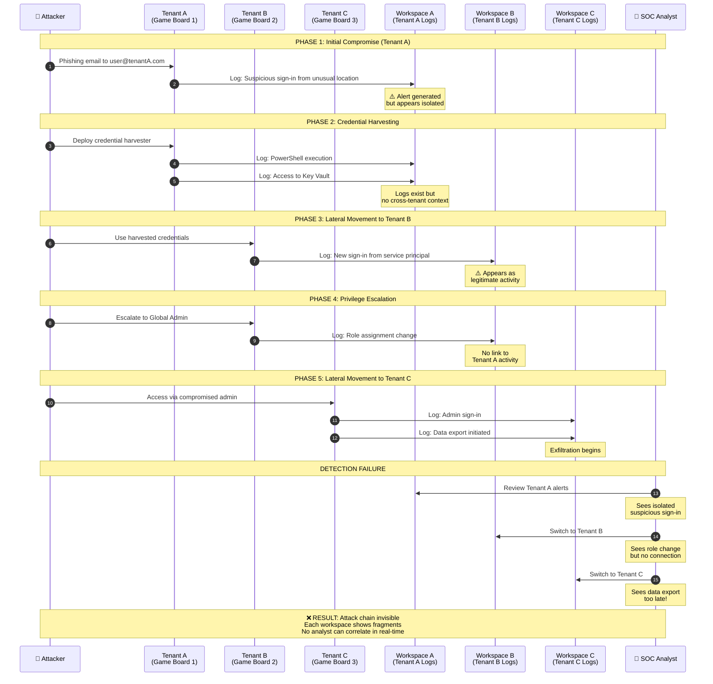
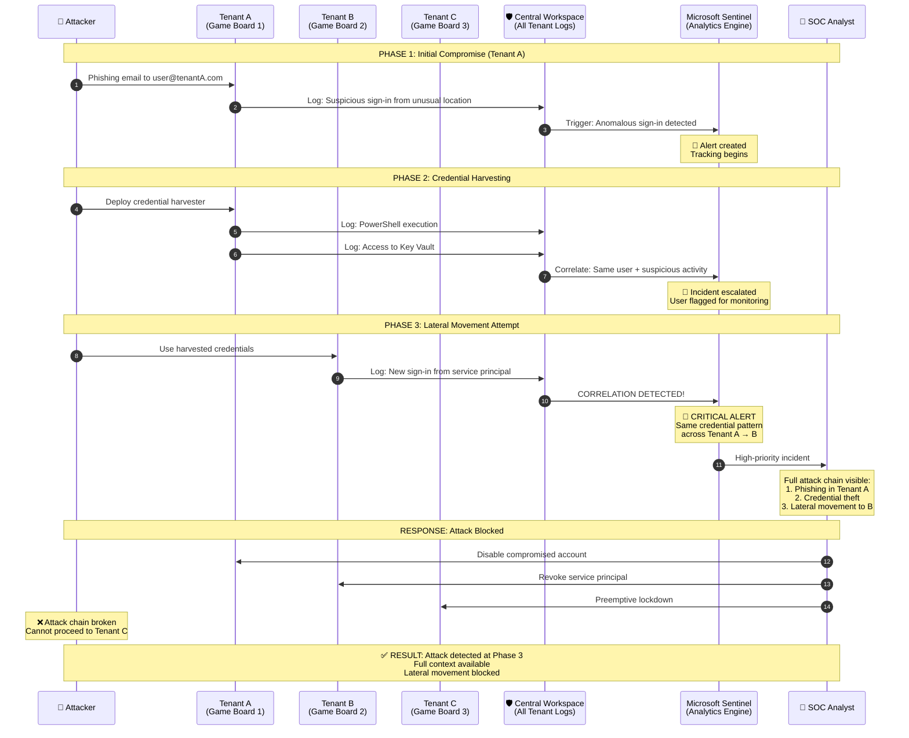
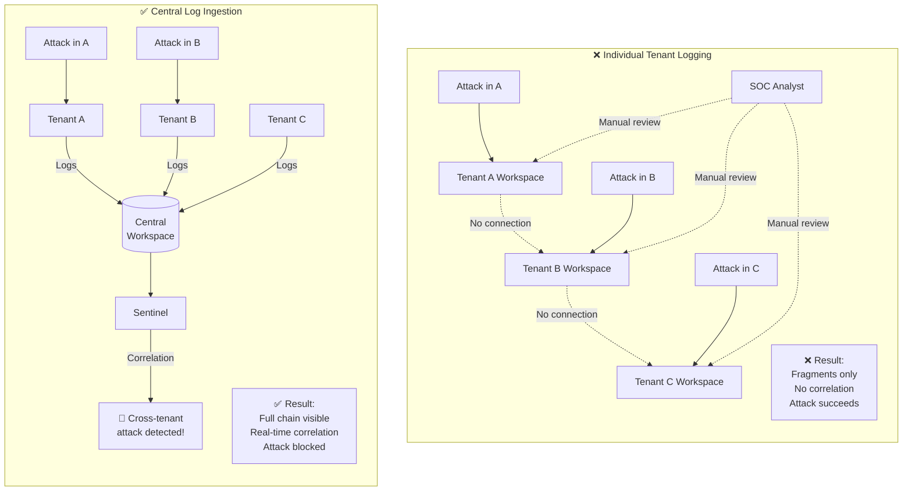

# Cross-Tenant Attack Detection: Central vs Individual Logging

> **Security Scenario Analysis** | Why Central Logging is Critical for Multi-Tenant Threat Detection

---

## Attack Scenario: Lateral Movement Across Simulation Tenants

An attacker compromises credentials in one simulation tenant and moves laterally across multiple tenants, escalating privileges and exfiltrating data. This diagram illustrates how the attack unfolds and why central logging is essential for detection.

---

## Scenario 1: Individual Tenant Logging (Attack Goes Undetected)



### Why Detection Failed

| Phase | What Happened | What SOC Saw | Why It Was Missed |
|-------|---------------|--------------|-------------------|
| 1 | Phishing compromise | Suspicious sign-in alert | Appeared as isolated incident |
| 2 | Credential harvesting | PowerShell + Key Vault access | No context of attacker intent |
| 3 | Lateral movement | New service principal sign-in | Looked like legitimate automation |
| 4 | Privilege escalation | Role assignment change | No link to previous activity |
| 5 | Data exfiltration | Data export logs | Discovered after the fact |

**Total Time to Detect**: Hours to days (if ever)
**Data Exfiltrated**: Complete

---

## Scenario 2: Central Log Ingestion (Attack Detected and Stopped)



### Why Detection Succeeded

| Phase | What Happened | What Sentinel Detected | Action Taken |
|-------|---------------|------------------------|--------------|
| 1 | Phishing compromise | Anomalous sign-in | Alert created, tracking started |
| 2 | Credential harvesting | Correlated suspicious activity | Incident escalated |
| 3 | Lateral movement | **Cross-tenant credential reuse** | 🚨 **Critical alert triggered** |
| 4 | — | Attack blocked | Accounts disabled |
| 5 | — | Attack blocked | No exfiltration |

**Total Time to Detect**: Minutes
**Data Exfiltrated**: None

---

## The Detection Difference



---

## Attack Indicators Across Tenants

The following table shows how attack indicators appear differently depending on logging architecture:

| Attack Indicator | Individual Logging View | Central Logging View |
|------------------|------------------------|---------------------|
| **Suspicious sign-in** | Isolated alert in Tenant A | First link in attack chain |
| **Credential access** | PowerShell event in Tenant A | Correlated with sign-in anomaly |
| **Service principal creation** | New identity in Tenant B | Same credential pattern as Tenant A |
| **Role escalation** | Admin change in Tenant B | Linked to compromised identity |
| **Data export** | Activity in Tenant C | **Never happens** — blocked earlier |

---

## Key Correlation Queries (Only Possible with Central Logging)

### Detect Cross-Tenant Credential Reuse

```kusto
// Find the same credential used across multiple tenants
SigninLogs
| where TimeGenerated > ago(24h)
| summarize 
    Tenants = make_set(TenantId),
    TenantCount = dcount(TenantId),
    SignInCount = count()
    by UserPrincipalName, IPAddress
| where TenantCount > 1
| order by TenantCount desc
```

### Track Lateral Movement Chain

```kusto
// Correlate activity across tenants for a specific user
let SuspiciousUser = "compromised@tenantA.com";
union SigninLogs, AuditLogs, AzureActivity
| where TimeGenerated > ago(7d)
| where Identity contains SuspiciousUser or UserPrincipalName == SuspiciousUser
| project TimeGenerated, TenantId, OperationName, ResultType, IPAddress
| order by TimeGenerated asc
```

### Detect Privilege Escalation After Cross-Tenant Movement

```kusto
// Find role assignments that follow cross-tenant sign-ins
let CrossTenantUsers = SigninLogs
    | where TimeGenerated > ago(24h)
    | summarize TenantCount = dcount(TenantId) by UserPrincipalName
    | where TenantCount > 1
    | project UserPrincipalName;
AuditLogs
| where TimeGenerated > ago(24h)
| where OperationName contains "role" or OperationName contains "member"
| where InitiatedBy.user.userPrincipalName in (CrossTenantUsers)
| project TimeGenerated, TenantId, OperationName, TargetResources
```

> ⚠️ **These queries are impossible with individual tenant logging** — the data required to correlate across tenants simply doesn't exist in any single workspace.

---

## Summary: Why Central Logging is Non-Negotiable

| Aspect | Individual Logging | Central Logging |
|--------|:------------------:|:---------------:|
| Cross-tenant attack visibility | ❌ Blind | ✅ Full visibility |
| Time to detect lateral movement | Hours to days | Minutes |
| Correlation queries | ❌ Impossible | ✅ Native |
| Attack chain reconstruction | ❌ Manual, after-the-fact | ✅ Real-time |
| Preemptive blocking | ❌ Cannot anticipate | ✅ Block before escalation |

**For simulation environments where attackers may move between tenants, central log ingestion is the only architecture that enables effective threat detection.**

---

*Related Documents:*
- [Central vs Individual Logging Comparison](Central-vs-Individual-Logging-Comparison.md)
- [Telemetry Collection from Simulation Infrastructure (v5)](Telemetry-Collection-from-Simulation-Infrastructure-v5.md)
- [Azure Cross-Tenant Log Collection Execution Guide](azure-cross-tenant-log-collection-execution.md)
