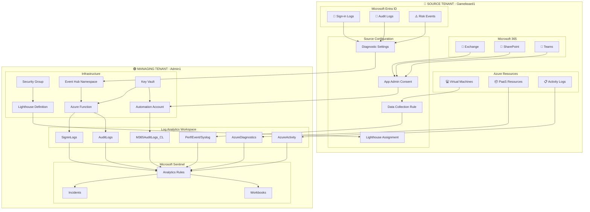
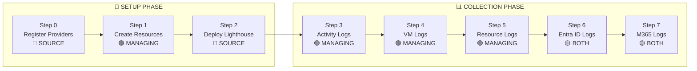
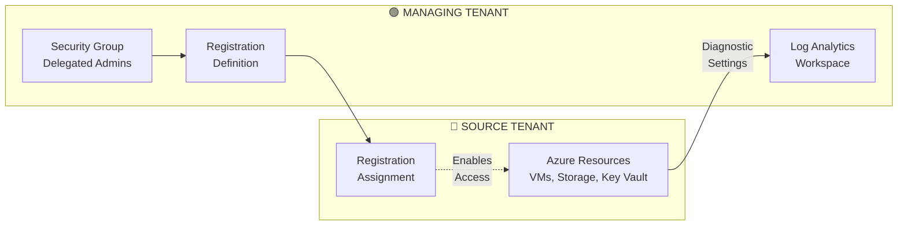
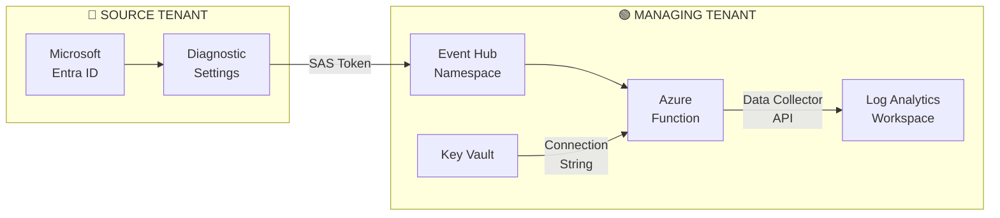
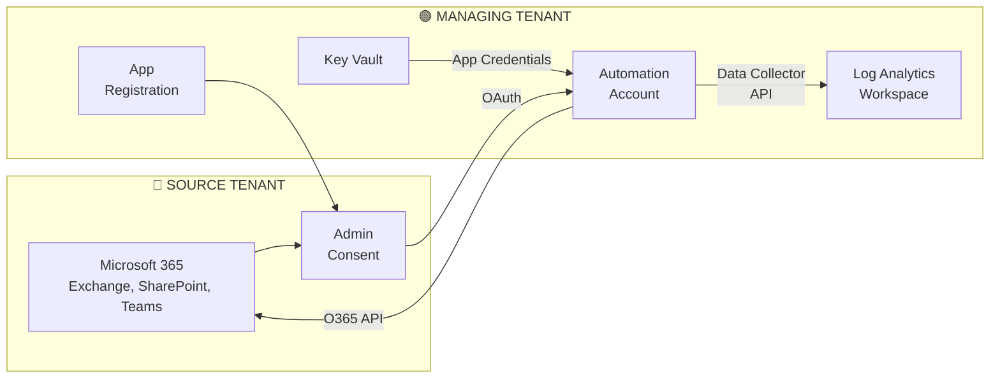
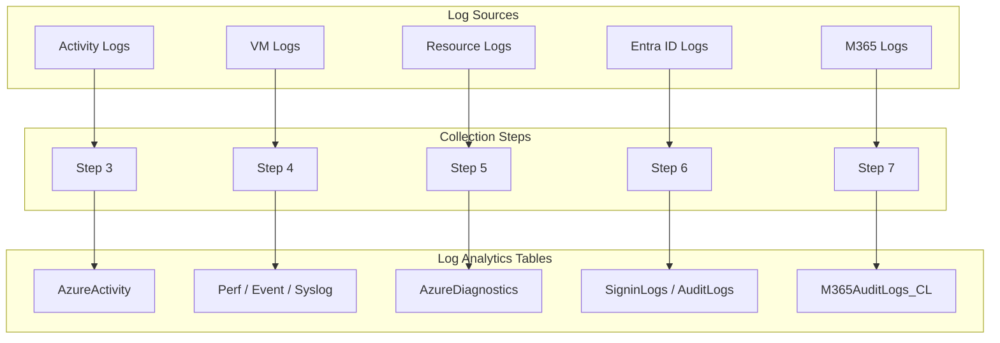
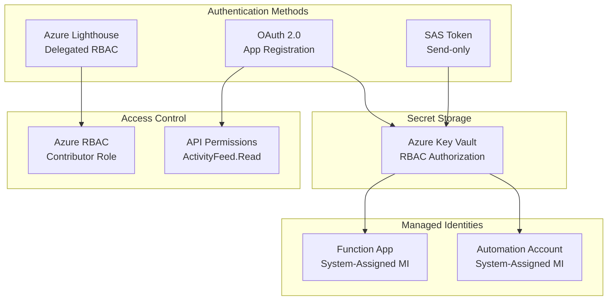
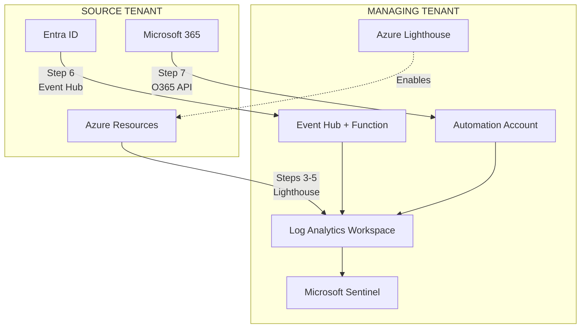

# Azure Cross-Tenant Log Collection - Mermaid Diagrams

This file contains Mermaid diagrams for the cross-tenant log collection architecture. These diagrams render in:
- GitHub (automatically)
- VS Code with the "Markdown Preview Mermaid Support" extension
- Mermaid Live Editor: https://mermaid.live

> **VS Code Extension:** Press `Ctrl+Shift+X`, search for "bierner.markdown-mermaid", and install.

---

## Complete Architecture Overview

---

## Setup Sequence

---

## Method 1: Azure Lighthouse Flow

---

## Method 2: Event Hub Flow

---

## Method 3: O365 Management API Flow

---

## Log Tables Mapping

---

## Security Architecture

---

## Component Deployment Order

```mermaid
gantt
    title Cross-Tenant Log Collection Setup
    dateFormat X
    axisFormat %s
    
    section Setup Phase
    Register Providers (SOURCE)     :s0, 0, 1
    Create Security Group (MANAGING) :s1, 1, 2
    Create Workspace (MANAGING)      :s1b, 1, 2
    Create Key Vault (MANAGING)      :s1c, 1, 2
    Deploy Lighthouse (SOURCE)       :s2, 2, 3
    
    section Collection Phase
    Activity Logs (MANAGING)         :s3, 3, 4
    VM Logs (MANAGING)               :s4, 4, 5
    Resource Logs (MANAGING)         :s5, 5, 6
    Entra ID Logs (BOTH)             :s6, 6, 7
    M365 Logs (BOTH)                 :s7, 7, 8
```

---

## Simplified Overview

