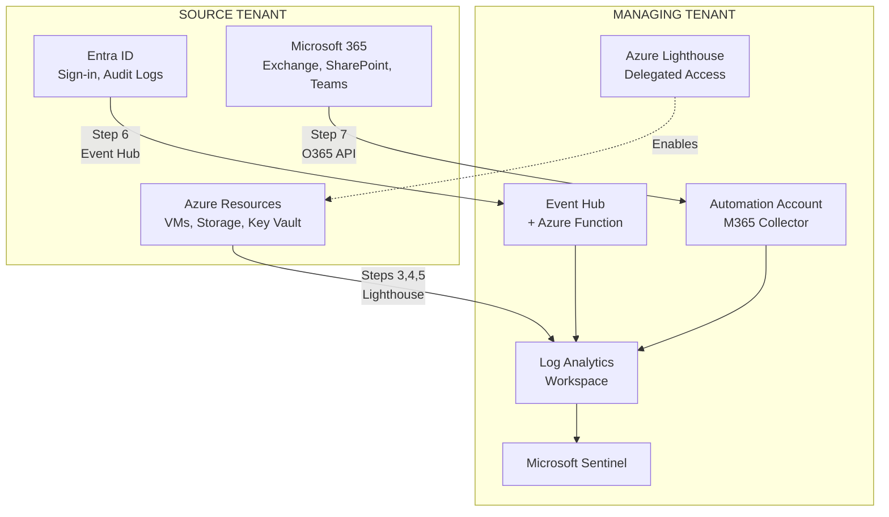

# Azure Cross-Tenant Log Collection Architecture

This document provides a comprehensive view of the cross-tenant log collection solution, showing all three log collection methods and the data flow from source tenants to the centralized Log Analytics workspace.

---

## Architecture Overview (ASCII)

```
┌─────────────────────────────────────────────────────────────────────────────────────────────────────┐
│                                    SOURCE TENANT (Gameboard1)                                        │
│                                                                                                      │
│   ┌─────────────────────┐    ┌─────────────────────┐    ┌─────────────────────┐                     │
│   │   AZURE RESOURCES   │    │   MICROSOFT ENTRA   │    │   MICROSOFT 365     │                     │
│   │                     │    │        ID           │    │                     │                     │
│   │  • Virtual Machines │    │  • Sign-in Logs     │    │  • Exchange Online  │                     │
│   │  • Key Vault        │    │  • Audit Logs       │    │  • SharePoint       │                     │
│   │  • Storage Accounts │    │  • Risk Events      │    │  • OneDrive         │                     │
│   │  • SQL Databases    │    │  • Service Principal│    │  • Teams            │                     │
│   │  • Activity Logs    │    │    Logs             │    │                     │                     │
│   └──────────┬──────────┘    └──────────┬──────────┘    └──────────┬──────────┘                     │
│              │                          │                          │                                 │
│              │ Steps 3,4,5              │ Step 6                   │ Step 7                          │
│              │ Lighthouse               │ Event Hub                │ O365 API                        │
│              │ Delegation               │ + SAS Token              │ + OAuth                         │
│              ▼                          ▼                          ▼                                 │
│   ┌──────────────────────────────────────────────────────────────────────────────────────────┐      │
│   │                              SOURCE TENANT CONFIGURATION                                  │      │
│   │                                                                                           │      │
│   │  ┌─────────────────┐  ┌─────────────────┐  ┌─────────────────┐  ┌─────────────────┐     │      │
│   │  │   Lighthouse    │  │ Data Collection │  │   Diagnostic    │  │ App Registration│     │      │
│   │  │   Assignment    │  │      Rule       │  │    Settings     │  │  Admin Consent  │     │      │
│   │  │   (Step 2)      │  │   (Step 4)      │  │   (Step 6)      │  │   (Step 7)      │     │      │
│   │  └─────────────────┘  └─────────────────┘  └─────────────────┘  └─────────────────┘     │      │
│   └──────────────────────────────────────────────────────────────────────────────────────────┘      │
│                                                                                                      │
└──────────────────────────────────────────────────────────────────────────────────────────────────────┘
                │                          │                          │
                │ Diagnostic               │ SAS Token                │ OAuth +
                │ Settings                 │ Connection               │ App Registration
                │                          │                          │
                ▼                          ▼                          ▼
┌──────────────────────────────────────────────────────────────────────────────────────────────────────┐
│                                    MANAGING TENANT (Admin1)                                          │
│                                                                                                      │
│   ┌─────────────────────────────────────────────────────────────────────────────────────────┐       │
│   │                              INFRASTRUCTURE LAYER                                        │       │
│   │                                                                                          │       │
│   │  ┌─────────────────┐  ┌─────────────────┐  ┌─────────────────┐  ┌─────────────────┐    │       │
│   │  │ Azure Lighthouse│  │   Event Hub     │  │ Azure Function  │  │   Automation    │    │       │
│   │  │                 │  │   Namespace     │  │                 │  │    Account      │    │       │
│   │  │ • Registration  │  │                 │  │ EntraIDLogs     │  │                 │    │       │
│   │  │   Definition    │  │ • eh-entra-logs │  │ Processor       │  │ M365 Audit Log  │    │       │
│   │  │ • Security Group│  │ • SAS Policies  │  │                 │  │ Collector       │    │       │
│   │  │   (Admins)      │  │ • Consumer Grp  │  │ (Python)        │  │ (PowerShell)    │    │       │
│   │  └─────────────────┘  └────────┬────────┘  └────────┬────────┘  └────────┬────────┘    │       │
│   │                                │                    │                    │             │       │
│   │                                └────────────────────┴────────────────────┘             │       │
│   │                                                     │                                  │       │
│   │                                          ┌──────────▼──────────┐                       │       │
│   │                                          │     Key Vault       │                       │       │
│   │                                          │                     │                       │       │
│   │                                          │ • Connection Strings│                       │       │
│   │                                          │ • App Credentials   │                       │       │
│   │                                          │ • Workspace Keys    │                       │       │
│   │                                          └──────────┬──────────┘                       │       │
│   └──────────────────────────────────────────────────────────────────────────────────────────┘       │
│                                                         │                                            │
│   ┌─────────────────────────────────────────────────────▼────────────────────────────────────┐      │
│   │                              LOG ANALYTICS WORKSPACE                                      │      │
│   │                              law-admin1-central-logging                                   │      │
│   │                                                                                           │      │
│   │  ┌──────────────┐ ┌──────────────┐ ┌──────────────┐ ┌──────────────┐ ┌──────────────┐   │      │
│   │  │AzureActivity │ │    Perf      │ │AzureDiag-   │ │ SigninLogs   │ │M365AuditLogs │   │      │
│   │  │              │ │    Event     │ │nostics      │ │ AuditLogs    │ │    _CL       │   │      │
│   │  │ (Step 3)     │ │   Syslog     │ │ (Step 5)    │ │ (Step 6)     │ │ (Step 7)     │   │      │
│   │  │              │ │  (Step 4)    │ │             │ │              │ │              │   │      │
│   │  └──────────────┘ └──────────────┘ └──────────────┘ └──────────────┘ └──────────────┘   │      │
│   └──────────────────────────────────────────────────────────────────────────────────────────┘      │
│                                                         │                                            │
│   ┌─────────────────────────────────────────────────────▼────────────────────────────────────┐      │
│   │                              MICROSOFT SENTINEL                                           │      │
│   │                                                                                           │      │
│   │  ┌──────────────────┐  ┌──────────────────┐  ┌──────────────────┐                        │      │
│   │  │  Analytics Rules │  │    Incidents     │  │    Workbooks     │                        │      │
│   │  │                  │  │                  │  │                  │                        │      │
│   │  │ • Threat Detection│ │ • Alert Triage   │  │ • Dashboards     │                        │      │
│   │  │ • Anomaly Detection│ │ • Investigation │  │ • Reports        │                        │      │
│   │  │ • Correlation     │  │ • Response       │  │ • Visualizations │                        │      │
│   │  └──────────────────┘  └──────────────────┘  └──────────────────┘                        │      │
│   └──────────────────────────────────────────────────────────────────────────────────────────┘      │
│                                                                                                      │
└──────────────────────────────────────────────────────────────────────────────────────────────────────┘
```

---

## Three Log Collection Methods

### Method 1: Azure Lighthouse (Steps 3, 4, 5)
**For:** Azure Activity Logs, VM Diagnostic Logs, PaaS Resource Logs

```
┌─────────────────┐     ┌─────────────────┐     ┌─────────────────┐
│  Source Tenant  │     │   Diagnostic    │     │  Log Analytics  │
│    Resources    │────▶│    Settings     │────▶│   Workspace     │
│                 │     │                 │     │ (Managing Tenant)│
└─────────────────┘     └─────────────────┘     └─────────────────┘
         │
         │ Enabled by Azure Lighthouse delegation
         ▼
┌─────────────────────────────────────────────────────────────────┐
│  Lighthouse Components:                                          │
│  • Registration Definition (Managing Tenant) - Defines roles     │
│  • Registration Assignment (Source Tenant) - Applies delegation  │
│  • Security Group (Managing Tenant) - Contains delegated admins  │
└─────────────────────────────────────────────────────────────────┘
```

### Method 2: Event Hub (Step 6)
**For:** Microsoft Entra ID Logs (Sign-in, Audit, Risk Events)

```
┌─────────────────┐     ┌─────────────────┐     ┌─────────────────┐     ┌─────────────────┐
│   Entra ID      │     │   Diagnostic    │     │   Event Hub     │     │ Azure Function  │
│   (Source)      │────▶│    Settings     │────▶│  (Managing)     │────▶│  (Managing)     │
│                 │     │   + SAS Token   │     │                 │     │                 │
└─────────────────┘     └─────────────────┘     └─────────────────┘     └────────┬────────┘
                                                                                  │
                                                                                  ▼
                                                                         ┌─────────────────┐
                                                                         │  Log Analytics  │
                                                                         │   Workspace     │
                                                                         └─────────────────┘
```

### Method 3: O365 Management API (Step 7)
**For:** Microsoft 365 Audit Logs (Exchange, SharePoint, Teams)

```
┌─────────────────┐     ┌─────────────────┐     ┌─────────────────┐     ┌─────────────────┐
│  Microsoft 365  │     │ App Registration│     │   Automation    │     │  Log Analytics  │
│   (Source)      │────▶│ + Admin Consent │────▶│    Account      │────▶│   Workspace     │
│                 │     │                 │     │  (Managing)     │     │                 │
└─────────────────┘     └─────────────────┘     └─────────────────┘     └─────────────────┘
                              │
                              │ OAuth 2.0 + O365 Management API
                              ▼
                        ┌─────────────────────────────────────────┐
                        │  API Permissions:                        │
                        │  • ActivityFeed.Read                     │
                        │  • ActivityFeed.ReadDlp                  │
                        │  • ServiceHealth.Read                    │
                        └─────────────────────────────────────────┘
```

---

## Setup Sequence

```
┌─────────────────────────────────────────────────────────────────────────────────────────┐
│                                    SETUP PHASE                                           │
├─────────────────────────────────────────────────────────────────────────────────────────┤
│                                                                                          │
│   Step 0                    Step 1                    Step 2                             │
│   SOURCE Tenant             MANAGING Tenant           SOURCE Tenant                      │
│                                                                                          │
│   ┌─────────────┐          ┌─────────────┐          ┌─────────────┐                     │
│   │  Register   │          │   Create    │          │   Deploy    │                     │
│   │  Resource   │─────────▶│  Security   │─────────▶│   Azure     │                     │
│   │  Providers  │          │  Group &    │          │ Lighthouse  │                     │
│   │             │          │  Workspace  │          │ Delegation  │                     │
│   └─────────────┘          └─────────────┘          └─────────────┘                     │
│                                                                                          │
└─────────────────────────────────────────────────────────────────────────────────────────┘
                                         │
                                         ▼
┌─────────────────────────────────────────────────────────────────────────────────────────┐
│                                  COLLECTION PHASE                                        │
├─────────────────────────────────────────────────────────────────────────────────────────┤
│                                                                                          │
│   Step 3              Step 4              Step 5              Step 6        Step 7       │
│   MANAGING            MANAGING            MANAGING            MANAGING*     MANAGING*    │
│                                                                                          │
│   ┌─────────┐        ┌─────────┐        ┌─────────┐        ┌─────────┐   ┌─────────┐   │
│   │Activity │        │   VM    │        │Resource │        │Entra ID │   │  M365   │   │
│   │  Logs   │───────▶│  Logs   │───────▶│  Logs   │───────▶│  Logs   │──▶│  Logs   │   │
│   │         │        │         │        │         │        │         │   │         │   │
│   └─────────┘        └─────────┘        └─────────┘        └─────────┘   └─────────┘   │
│                                                                                          │
│   * Steps 6 and 7 require authentication to BOTH tenants                                │
│                                                                                          │
└─────────────────────────────────────────────────────────────────────────────────────────┘
```

---

## Component Reference

### Source Tenant Components

| Component | Created In | Purpose |
|-----------|------------|---------|
| Lighthouse Registration Assignment | Step 2 | Grants managing tenant access to subscriptions |
| Data Collection Rule (DCR) | Step 4 | Configures what VM logs to collect |
| Entra ID Diagnostic Settings | Step 6 | Streams Entra logs to Event Hub |
| App Registration Admin Consent | Step 7 | Grants M365 API access to managing tenant app |

### Managing Tenant Components

| Component | Created In | Purpose |
|-----------|------------|---------|
| Security Group | Step 1 | Contains users with delegated access |
| Log Analytics Workspace | Step 1 | Central repository for all logs |
| Key Vault | Step 1 | Stores secrets and connection strings |
| Lighthouse Registration Definition | Step 2 | Defines permissions granted via delegation |
| Event Hub Namespace | Step 6 | Receives Entra ID logs from source tenant |
| Azure Function | Step 6 | Processes Event Hub messages to Log Analytics |
| Automation Account | Step 7 | Runs scheduled M365 log collection |

---

## Log Tables Reference

| Table Name | Log Source | Collection Method | Step |
|------------|------------|-------------------|------|
| `AzureActivity` | Subscription Activity Logs | Lighthouse + Diagnostic Settings | 3 |
| `Perf` | VM Performance Counters | Azure Monitor Agent + DCR | 4 |
| `Event` | Windows Event Logs | Azure Monitor Agent + DCR | 4 |
| `Syslog` | Linux System Logs | Azure Monitor Agent + DCR | 4 |
| `AzureDiagnostics` | PaaS Resource Logs | Lighthouse + Diagnostic Settings | 5 |
| `SigninLogs` | Entra ID Sign-ins | Event Hub + Azure Function | 6 |
| `AuditLogs` | Entra ID Audit Events | Event Hub + Azure Function | 6 |
| `AADRiskyUsers` | Entra ID Risk Events | Event Hub + Azure Function | 6 |
| `M365AuditLogs_CL` | M365 Audit Events | O365 API + Automation Account | 7 |

---

## Security Considerations

| Aspect | Implementation |
|--------|----------------|
| **Cross-Tenant Access** | Azure Lighthouse with Contributor role (least-privilege) |
| **Credential Storage** | Azure Key Vault with RBAC authorization |
| **Event Hub Security** | SAS tokens with Send-only permission for source tenant |
| **API Authentication** | OAuth 2.0 with multi-tenant app registration |
| **Data in Transit** | TLS 1.2+ encryption for all connections |
| **Audit Trail** | All operations logged in Azure Activity Log |
| **Identity** | System-assigned Managed Identities for Function and Automation |

---

## Mermaid Diagram (for GitHub/VS Code Preview)

If you have Mermaid rendering enabled, the following diagram will display:



> **Note:** To view Mermaid diagrams in VS Code, install the "Markdown Preview Mermaid Support" extension (`Ctrl+Shift+X`, search for "bierner.markdown-mermaid").
