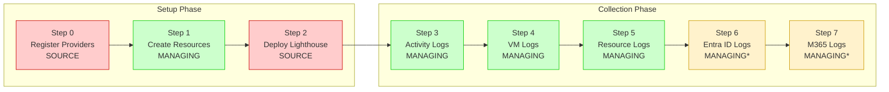

# Azure Cross-Tenant Log Collection Architecture

This diagram provides a comprehensive view of the cross-tenant log collection solution, showing all three log collection methods and the data flow from source tenants to the centralized Log Analytics workspace.

## Complete Architecture Diagram

```mermaid
flowchart TB
    subgraph SOURCE["SOURCE TENANT - Gameboard1"]
        subgraph AzureResources["Azure Resources"]
            VMs["Virtual Machines<br/>Windows/Linux"]
            PaaS["PaaS Resources<br/>Key Vault, Storage,<br/>SQL, App Service"]
            ActivityLog["Activity Log<br/>Subscription Operations"]
        end
        
        subgraph EntraID["Microsoft Entra ID"]
            SignIn["Sign-in Logs"]
            Audit["Audit Logs"]
            Risk["Risk Events"]
            SPN["Service Principal Logs"]
        end
        
        subgraph M365["Microsoft 365"]
            Exchange["Exchange Online<br/>Email, Calendar"]
            SharePoint["SharePoint/OneDrive<br/>File Operations"]
            Teams["Microsoft Teams<br/>Messages, Meetings"]
        end
        
        subgraph SourceConfig["Source Tenant Configuration"]
            LHAssign["Lighthouse<br/>Registration Assignment"]
            DCR["Data Collection Rule<br/>VM Log Config"]
            DiagSettings["Diagnostic Settings<br/>Entra ID to Event Hub"]
            AppConsent["App Registration<br/>Admin Consent"]
        end
    end
    
    subgraph MANAGING["MANAGING TENANT - Admin1"]
        subgraph LighthouseAccess["Azure Lighthouse"]
            LHDef["Registration Definition<br/>Contributor Role"]
            SecGroup["Security Group<br/>Delegated Admins"]
        end
        
        subgraph EventHubInfra["Event Hub Infrastructure"]
            EHNamespace["Event Hub Namespace"]
            EH["Event Hub<br/>eh-entra-id-logs"]
            SASPolicy["SAS Policy<br/>Send Permission"]
        end
        
        subgraph Processing["Log Processing"]
            FuncApp["Azure Function<br/>EntraIDLogsProcessor"]
            AutoAcct["Automation Account<br/>M365 Log Collector"]
        end
        
        subgraph CentralLogging["Central Logging"]
            LAW["Log Analytics Workspace<br/>law-admin1-central-logging"]
            KV["Key Vault<br/>Secrets Storage"]
        end
        
        subgraph Sentinel["Microsoft Sentinel"]
            Analytics["Analytics Rules"]
            Incidents["Incidents"]
            Workbooks["Workbooks"]
        end
        
        subgraph LogTables["Log Analytics Tables"]
            AzActivity["AzureActivity"]
            Perf["Perf / Event / Syslog"]
            AzDiag["AzureDiagnostics"]
            SignInLogs["SigninLogs"]
            AuditLogs["AuditLogs"]
            M365Logs["M365AuditLogs_CL"]
        end
    end
    
    %% Method 1: Azure Lighthouse - Steps 3, 4, 5
    LHDef --> LHAssign
    SecGroup --> LHDef
    
    ActivityLog -->|"Step 3<br/>Diagnostic Settings"| AzActivity
    VMs -->|"Step 4<br/>AMA + DCR"| Perf
    PaaS -->|"Step 5<br/>Diagnostic Settings"| AzDiag
    
    %% Method 2: Event Hub - Step 6
    SignIn --> DiagSettings
    Audit --> DiagSettings
    Risk --> DiagSettings
    SPN --> DiagSettings
    DiagSettings -->|"SAS Token"| EH
    EH --> FuncApp
    FuncApp -->|"Data Collector API"| SignInLogs
    FuncApp --> AuditLogs
    
    %% Method 3: O365 Management API - Step 7
    Exchange --> AppConsent
    SharePoint --> AppConsent
    Teams --> AppConsent
    AppConsent -->|"OAuth + API"| AutoAcct
    AutoAcct -->|"Data Collector API"| M365Logs
    
    %% Secrets
    KV -->|"Connection Strings<br/>App Credentials"| FuncApp
    KV -->|"App ID + Secret<br/>Workspace Key"| AutoAcct
    
    %% Log Analytics to Sentinel
    AzActivity --> LAW
    Perf --> LAW
    AzDiag --> LAW
    SignInLogs --> LAW
    AuditLogs --> LAW
    M365Logs --> LAW
    
    LAW --> Analytics
    Analytics --> Incidents
    LAW --> Workbooks
    
    %% Styling
    classDef sourceBox fill:#ffcccc,stroke:#cc0000,stroke-width:2px
    classDef managingBox fill:#ccffcc,stroke:#00cc00,stroke-width:2px
    classDef lighthouse fill:#cce5ff,stroke:#0066cc,stroke-width:2px
    classDef eventhub fill:#fff2cc,stroke:#cc9900,stroke-width:2px
    classDef m365 fill:#e6ccff,stroke:#6600cc,stroke-width:2px
    classDef central fill:#ccffff,stroke:#00cccc,stroke-width:2px
    
    class SOURCE sourceBox
    class MANAGING managingBox
    class LighthouseAccess,LHDef,SecGroup,LHAssign lighthouse
    class EventHubInfra,EHNamespace,EH,SASPolicy,FuncApp eventhub
    class M365,Exchange,SharePoint,Teams,AutoAcct,AppConsent m365
    class CentralLogging,LAW,KV,Sentinel,Analytics,Incidents,Workbooks central
```



## Data Flow Summary

### Method 1: Azure Lighthouse (Steps 3, 4, 5)
**For:** Azure Activity Logs, VM Logs, PaaS Resource Logs

```
Source Tenant Resources → Diagnostic Settings → Log Analytics Workspace (Managing Tenant)
```

| Component | Location | Purpose |
|-----------|----------|---------|
| Registration Definition | Managing Tenant | Defines permissions granted |
| Registration Assignment | Source Tenant | Applies delegation to subscription |
| Security Group | Managing Tenant | Contains users with delegated access |
| Data Collection Rule | Source Tenant | Configures VM log collection |
| Diagnostic Settings | Source Tenant | Routes logs to LAW |

### Method 2: Event Hub (Step 6)
**For:** Microsoft Entra ID Logs (Sign-in, Audit, Risk Events)

```
Entra ID → Diagnostic Settings → Event Hub → Azure Function → Log Analytics Workspace
```

| Component | Location | Purpose |
|-----------|----------|---------|
| Event Hub Namespace | Managing Tenant | Receives Entra ID logs |
| SAS Policy (Send) | Managing Tenant | Allows source tenant to send logs |
| Diagnostic Settings | Source Tenant | Streams logs to Event Hub |
| Azure Function | Managing Tenant | Processes and forwards to LAW |
| Key Vault | Managing Tenant | Stores connection strings |

### Method 3: O365 Management API (Step 7)
**For:** Microsoft 365 Audit Logs (Exchange, SharePoint, Teams)

```
M365 Services → O365 Management API → Automation Account → Log Analytics Workspace
```

| Component | Location | Purpose |
|-----------|----------|---------|
| App Registration | Managing Tenant | Multi-tenant app for API access |
| Admin Consent | Source Tenant | Grants API permissions |
| Automation Account | Managing Tenant | Runs scheduled log collection |
| Key Vault | Managing Tenant | Stores app credentials |

## Log Tables Reference

| Table Name | Source | Collection Method |
|------------|--------|-------------------|
| `AzureActivity` | Subscription Activity Logs | Lighthouse + Diagnostic Settings |
| `Perf` | VM Performance Counters | AMA + DCR |
| `Event` | Windows Event Logs | AMA + DCR |
| `Syslog` | Linux System Logs | AMA + DCR |
| `AzureDiagnostics` | PaaS Resource Logs | Lighthouse + Diagnostic Settings |
| `SigninLogs` | Entra ID Sign-ins | Event Hub + Function |
| `AuditLogs` | Entra ID Audit Events | Event Hub + Function |
| `AADRiskyUsers` | Entra ID Risk Events | Event Hub + Function |
| `M365AuditLogs_CL` | M365 Audit Events | O365 API + Automation |

## Setup Sequence



> **Note:** Steps marked with * require authentication to BOTH tenants during execution.

## Security Considerations

| Aspect | Implementation |
|--------|----------------|
| **Cross-Tenant Access** | Azure Lighthouse with least-privilege roles |
| **Credential Storage** | Azure Key Vault with RBAC |
| **Event Hub Security** | SAS tokens with Send-only permission |
| **API Authentication** | OAuth 2.0 with app registration |
| **Data in Transit** | TLS 1.2+ encryption |
| **Audit Trail** | All operations logged in Activity Log |
